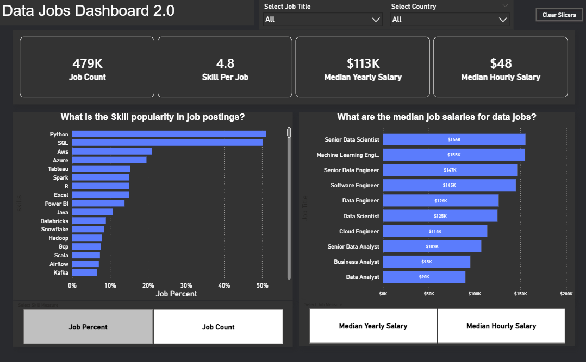

# Data Jobs Dashboard v2 w/ Power BI

## Introduction
Navigating the data career landscape can feel like a maze. Dashboard V2.0 simplifies the search by providing actionable insights powered by actual 2024 job market data. Whether you are entering the field or pivoting to a new role, this tool offers a streamlined interface to analyze global hiring trends and compensation.

## Dashboard File
The source file for this project is available here: [Data_Jobs_DashBoard_2.0.pbix](<d:/Power bi stuff/Data_Jobs_DashBoard_2.0.pbix>)

## Skills Showcased
**Data Engineering & Modeling**

- **ETL Pipeline**: Utilized Power Query to perform extensive data cleaning, normalization, and shaping to ensure data integrity.

- **Schema Design**: Engineered a robust Star Schema data model, optimizing relationships for performance and scalability.

- **Advanced Analytics**: Authored custom DAX (Data Analysis Expressions) to calculate complex measures, KPIs, and time-intelligence aggregations.

**Visualization & UI/UX**

- **Intuitive Design**: Crafted a user-centric dashboard layout focused on visual hierarchy and "at-a-glance" insight delivery.

- **Comprehensive Viz Suite**: Trend Analysis: Line and Area charts for temporal patterns.

- **Comparison Tools**: Bar and Column charts for cross-category benchmarking.

- **Interactive Storytelling**: Dynamic Filtering: Implemented Slicers for granular, user-driven data exploration.

## Dashboard Overview
In this update, I’ve condensed the reporting into a single, high-impact interface. Version 2.0 prioritizes speed and clarity, putting the most vital data points at your fingertips without the clutter.

**Key Update**: Optimized layout for immediate insight extraction and a reduced cognitive load for the user.

| Feature | Description |
| :--- | :--- |
| **Primary KPIs** | Real-time tracking of Job Count, Skill Density, and Median Pay. |
| **Skill Popularity** | Data-driven insights into which tools are most in demand (by % or count). |
| **Salary Analysis** | Comparative views of compensation across different data roles. |
| **Efficiency View** | High-density layout designed for immediate insight extraction. |

## Conclusion
Version 2.0 represents a significant UI/UX evolution, showcasing advanced Power BI capabilities in data storytelling and information density. The dashboard provides a streamlined environment for "Job Swappers" and "Transitioners" to filter through massive datasets efficiently, turning exhaustive market research into a 30-second insight.